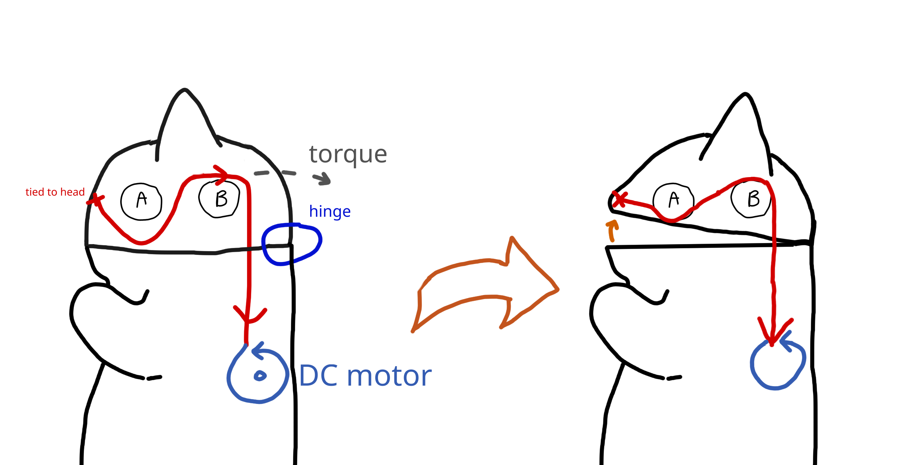
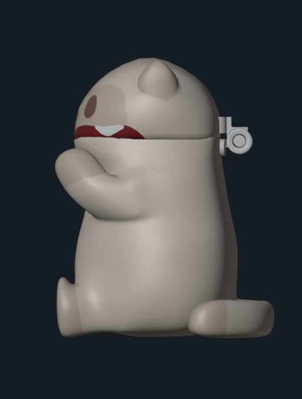
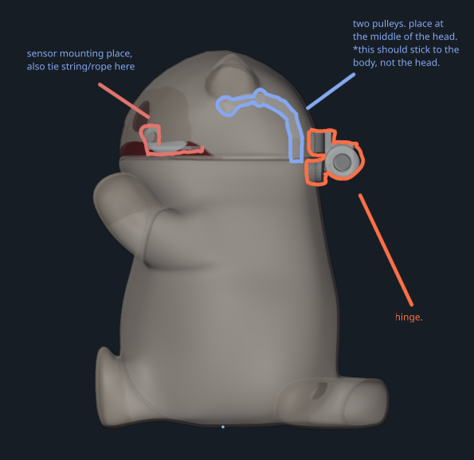
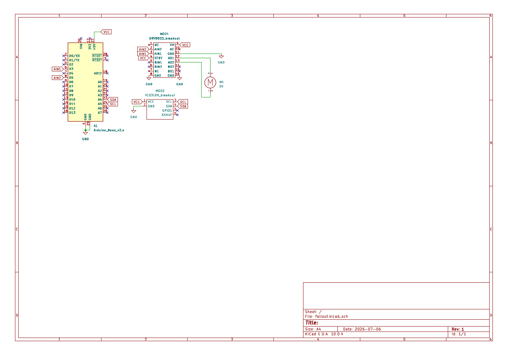
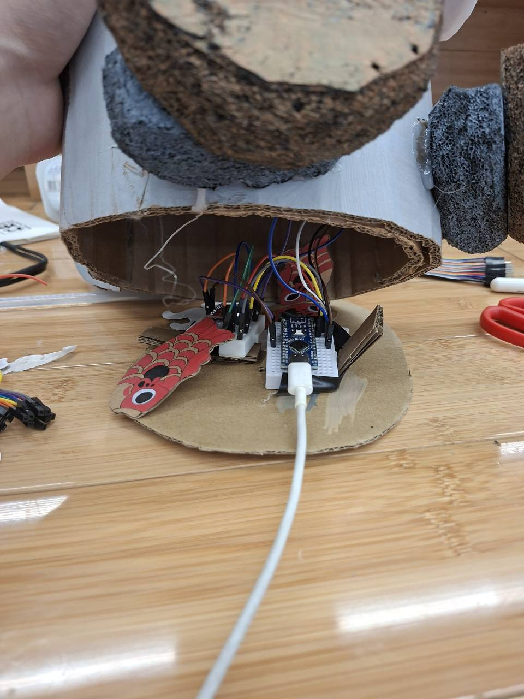
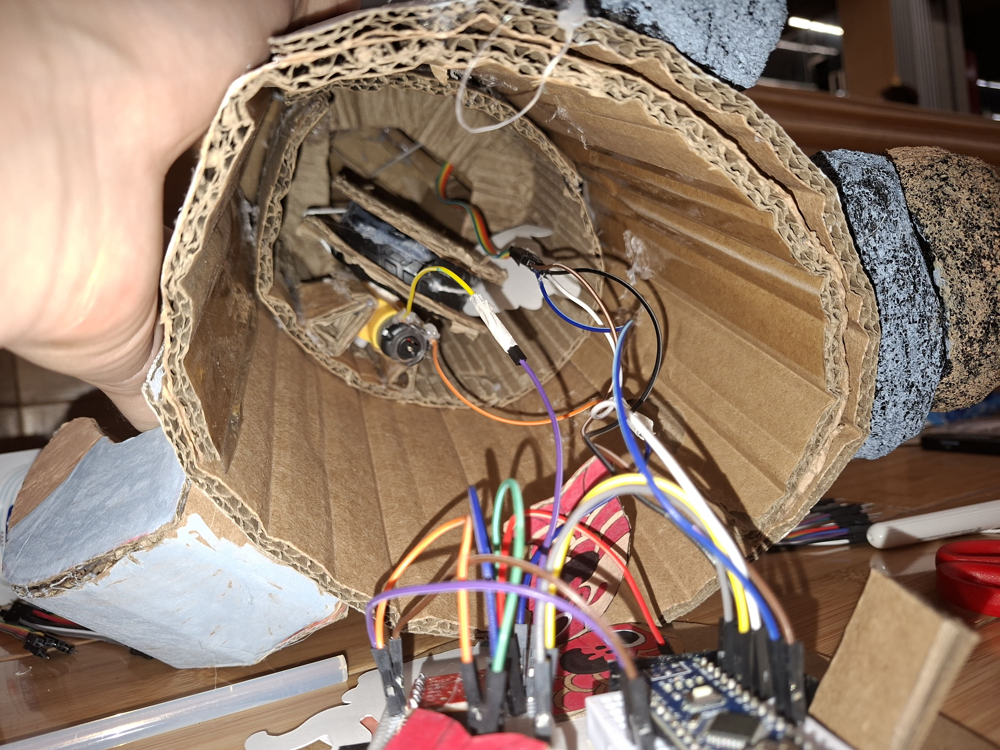

# FEED SOUP! But IRL

	
	 <a href="./zine.pdf">View Magazine</a>

COME AND FEED SOUP KOI OR ANYTHING ELSE THAT'LL MAKE HIM HAPPY!

# Background
The world is ending on 6 july, because soup wants to eat world! the only thing we could do is feed soup to prevent the soupocalypse due to soup crashing out! he likes eveything, moreover your KOI! give soup food! feed soup feed soup!

# How to Use
Put anything that'll make Soup happy to his mouth and he will happily munch your food!

# How it Works

Soup's mouth movement is powered by a DC motor which is controlled by an Arduino Nano. A two-pulley mechanism is used on a string to turn the rotational motion of the DC motor into torque for the hinge which in turns opens Soup's mouth. Unwinding the string will cause the string to become longer and allows gravity to pull Soup's head back down again.

During idle, Soup's head sits with pulled string which causes its mouth to open. A time-of-flight sensor is used to detect when an object comes near Soup's mouth. If an object comes close to Soup's mouth, the DC motor will unwind and wind the string repeatedly to create a chewing motion.

# Build Instructions

You will need:
1. Soldering iron
2. Solder
3. Everything from [BOM](#materials)
4. Wire Stripper
5. Scissors
6. Hot Glue Gun

This project is made for Fallout 2026 hackathon in which we only had approximately 4 days to build and submit a hardware, so we used breadboards and jumper wires to wire up everything. In case you really want to build it from the ground up properly, simply create a PCB following the wiring schematic later given in this document!

Steps:

1. Create your Soup model:
    - Two cylindrical cardboards as Soup's lower body and chest, combined together with the height of 27 cm.
    - Create Soup's head by modeling a half sphere. You can create a 2-dimensional donut shape, add some support wireframes (with cardboard or actual wire), then wrap everything with thinner paper.
    - Glue two ears to Soup's head with shape that roughly represents elongated triangle. Fold the ears to two to add depth.
    - Add legs! We sculpted some foam used for Bambu Lab printer packaging.
    - Add Soup's arms! we sculpted some foam used for Bambu Lab printer packaging alongside crumpled papers and a sheet of paper that wraps each arm.
    - Create Soup's tail by cutting two tail shapes and using a long cardboard to wrap them together.
2. Assemble the components needed.
3. Mount the electronics together into Soup. In this case, we used cardboard.

# Project Design & Assembly Showcase

## Materials

The materials used for this are:

1. Breadboards
2. Arduino Nano
3. PLA Filament (for hinge)
4. VL53L0X (time of flight sensor)
5. Jumper Cables
6. Yellow DC Motor
7. Paint

## Assembly Diagram

Note: this diagram is intended as a reference for where to place things only.

## Wiring Diagram

[PDF of Schematic](./showcase/schematic.pdf)

## 3D Models

3D models as reference (or possibly for 3D printing) can be found in the [3d folder](./3d/)!

## Firmware

The firmware for this project can be found in .
